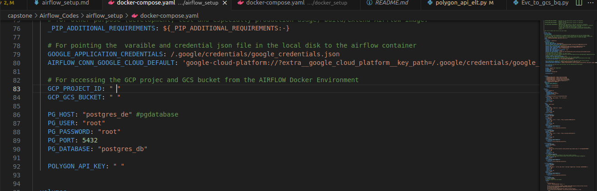

# Airflow Docker-Compose Setup

## Setup (official)

### Requirements
1. Upgrade docker-compose version:2.x.x+
2. Allocate memory to docker between 4gb-8gb
3. Python: version 3.8+


### Set Airflow

1.  On Linux, the quick-start needs to know your host user-id and needs to have group id set to 0.
    Otherwise the files created in `dags`, `logs` and `plugins` will be created with root user.

2.  set your airflow user id using:

    ```bash
    echo -e "AIRFLOW_UID=$(id -u)" > .env
    ```

    For Windows same as above.

    Create `.env` file with the content below as:

    ```
    AIRFLOW_UID=50000
    ```
3. Download or import the docker setup file from airflow's website : Run this on terminal
```
curl -LfO 'https://airflow.apache.org/docs/apache-airflow/stable/docker-compose.yaml'
```
4. Create "Dockerfile" use to build airflow container image.

5. Add this to the Dockerfile:
```
FROM apache/airflow:2.6.3
# For local file running
RUN pip install --no-cache-dir "apache-airflow==${AIRFLOW_VERSION}" pandas sqlalchemy psycopg2-binary
USER root
RUN apt-get update \
&& apt-get install -y --no-install-recommends \
vim \
&& apt-get autoremove -yqq --purge \
&& apt-get clean \
&& rm -rf /var/lib/apt/lists/*
WORKDIR $AIRFLOW_HOME
USER $AIRFLOW_UID
```
6. Go into the docker-compose.yaml file for the airflow and replace the build context with:
```
 build:
    context: .
    dockerfile: ./Dockerfile
```
7. Save all the modified files

8. Build image: docker-compose build

9. Initialize airflow db; docker-compose up airflow-init

10. Initialize all the other services: docker-compose up

### SetUp GCP for Local System (Local Environment Oauth-authentication)
1. Create GCP PROJECT
2. Create service account: Add Editor and storage admin, storage object admins and bigquery admin
3. Create credential keys and download it
4. Change name and location
```bash
cd ~ && mkdir -p ~/.google/credentials/

mv <path/to/your/service-account-authkeys>.json ~/.google/credentials/google_credentials.json
```

   Below is an example
   
```
mv  /home/krissemmy/Downloads/alt-data-engr-1dfdbf9f8dbf.json ~/.google/credentials/google_credentials.json
```
4. Install gcloud on system : open new terminal and run    (follow this link to install gcloud-sdk : https://cloud.google.com/sdk/docs/install-sdk)

    ```bash
    gcloud -v
    ```
  to see if its installed successfully
5. Set the google applications credentials environment variable

  ```bash
  export GOOGLE_APPLICATION_CREDENTIALS="/path/to/.json-file"
  ```

  Below is an example

  ```bash
  export GOOGLE_APPLICATION_CREDENTIALS = "/home/krissemmy/.google/credentials/google_credentials.json"
  ```
6. Run gcloud auth application-default login
7. Redirect to the website and authenticate local environment with the cloud environment

## Enable API
perform the following on your Google Cloud Platform
1. Enable Identity  and Access management API
2. Enable IAM Service Account Credentials API


## Update docker-compose file and Dockerfile
1. Add google credentials "GOOGLE_APPLICATION_CREDENTIALS" , project_id, bucket name and API key (From [Socrata Website](https://data.sfgov.org/profile/edit/developer_settings))
    ```
        GOOGLE_APPLICATION_CREDENTIALS: /.google/credentials/google_credentials.json
        AIRFLOW_CONN_GOOGLE_CLOUD_DEFAULT: 'google-cloud-platform://?extra__google_cloud_platform__key_path=/.google/credentials/google_credentials.json'

        GCP_PROJECT_ID: "my-project-id"
        GCP_GCS_BUCKET: "my-bucket"
    ```
2. Add the below line to the volumes of the airflow documentation

    ```
    ~/.google/credentials/:/.google/credentials:ro
    ```
    Also add your polygon API key



3. build airflow container image with:
```bash
docker-compose build
```
4. Initialize airflow db;
```bash
docker-compose up airflow-init
```
5. Initialize all the other services: 
```bash
docker-compose up
```
6. Inside plugins/web/operators folder is the python file with the SocrataToGCSOperator.
7. Inside dags folder is polygon_api_elt.py file with all the neccessary dag code.
8. To check if all containers are running fine and healthy, open a new terminal run the below
```bash
docker ps
```
9. You can connect to your Airflow webserver interface at http://localhost:8080/
10. Default username and password is 

username : airflow

password : airflow

11. Unpause your DAG and watch your pipeline get kickstarted, and happy Data Engineering.
